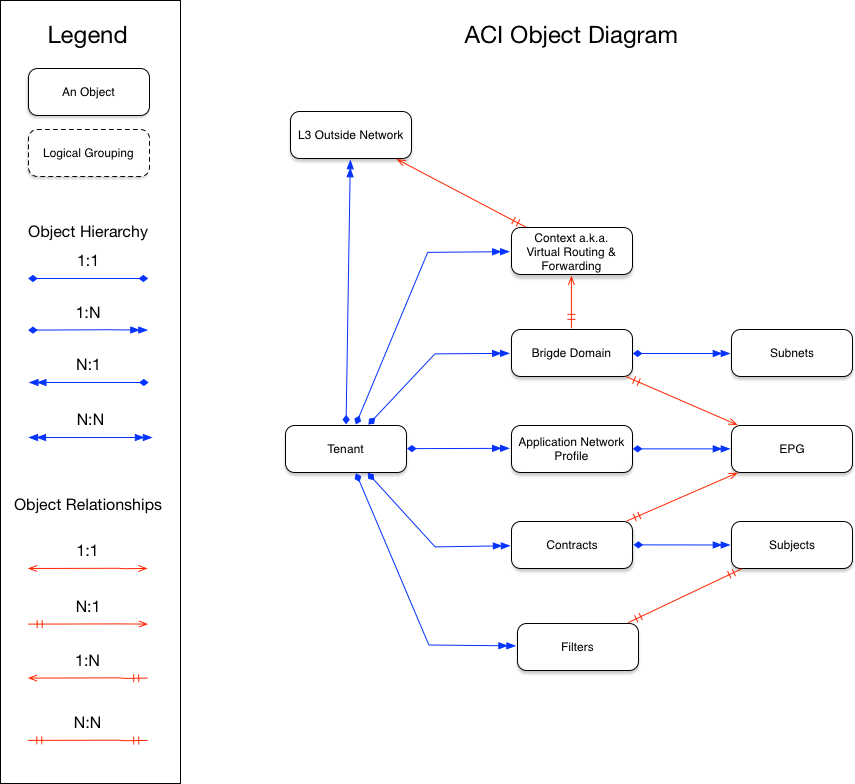

# Cisco ACI Module

This repo contains a terraform module for deploying applications on Cisco hardware via [Cisco ACI](https://www.cisco.com/c/en/us/solutions/data-center-virtualization/application-centric-infrastructure/index.html).

## Resources

This module will allow you to provision the ACI objects that are most commonly used or deployed in immutable application architectures.
- [Tenant](https://www.cisco.com/c/en/us/td/docs/switches/datacenter/aci/apic/sw/1-x/Operating_ACI/guide/b_Cisco_Operating_ACI/b_Cisco_Operating_ACI_chapter_0111.html) A high level object that separates one set of resources from another between two separate business groups or clients.
- [Application Profile Group](https://www.cisco.com/c/en/us/td/docs/switches/datacenter/aci/apic/sw/1-x/Operating_ACI/guide/b_Cisco_Operating_ACI/b_Cisco_Operating_ACI_chapter_0111.html#concept_F4947E22AD2143749DAC34E69F80706F) An object with the purpose of containing one or more EPGs in a logical grouping.
- [EPG](https://www.cisco.com/c/en/us/td/docs/switches/datacenter/aci/apic/sw/1-x/Operating_ACI/guide/b_Cisco_Operating_ACI/b_Cisco_Operating_ACI_chapter_0111.html#concept_81AC0F90789B454F80E796A7029EFD1E) An object that provides a contract to be consumed by another EPG. Conceptually similar to Kuberenetes service.
- [Contacts, Subjects, and Filters](https://www.cisco.com/c/en/us/td/docs/switches/datacenter/aci/apic/sw/1-x/Operating_ACI/guide/b_Cisco_Operating_ACI/b_Cisco_Operating_ACI_chapter_01000.html) Contracts are provided by one EPG and consumed by another, and contain multiple subjects, which themselves may contain multiple filters. Filters how ever are not a child object of the contract as they may belong to other contracts, and as such remain their own top level object and are consumed by contracts via a many-to-many relationship with subjects.

## What's a Module?

A Module is a canonical, reusable, best-practices definition for how to run a single piece of infrastructure, such
as a database or server cluster. Each Module is created using [Terraform](https://www.terraform.io/), and
includes automated tests, examples, and documentation. It is maintained both by the open source community and
companies that provide commercial support.

Instead of figuring out the details of how to run a piece of infrastructure from scratch, you can reuse
existing code that has been proven in production. And instead of maintaining all that infrastructure code yourself,
you can leverage the work of the Module community to pick up infrastructure improvements through
a version number bump.

## Who maintains this Module?

This Module is maintained by [IGNW](http://www.ignw.io/). If you're looking for help or commercial
support, send an email to [support@infogroupnw.com](mailto:support@infogroupnw.com?Subject=Jenkins%20Module).
IGNW can help with:

* Setup, customization, and support for this Module.
* Modules for other types of infrastructure, such as VPCs, Docker clusters, databases, and continuous integration.
* Modules that meet compliance requirements, such as FedRamp, HIPAA.
* Consulting & Training on AWS, Azure, GCP, Terraform, and DevOps.

## Code included in this Module:

* [Cisco Terraform Prodiver](https://github.com/ignw/terraform-provider-cisco-aci/tree/master/terraform-provider-cisco-aci): The module includes Terraform code to deploy a Jenkins master on AWS and setup

## How is this Module versioned?

This Module follows the principles of [Semantic Versioning](http://semver.org/). You can find each new release,
along with the changelog, in the [Releases Page](../../releases).

During initial development, the major version will be 0 (e.g., `0.x.y`), which indicates the code does not yet have a
stable API. Once we hit `1.0.0`, we will make every effort to maintain a backwards compatible API and use the MAJOR,
MINOR, and PATCH versions on each release to indicate any incompatibilities.

## License

This code is released under the Mozilla . Please see [LICENSE](https://github.com/ignw/terraform-provider-cisco-aci/tree/master/LICENSE) and [NOTICE](https://github.com/ignw/terraform-provider-cisco-aci/tree/master/NOTICE) for more
details.

Copyright &copy; 2018 InfogroupNW, Inc.
